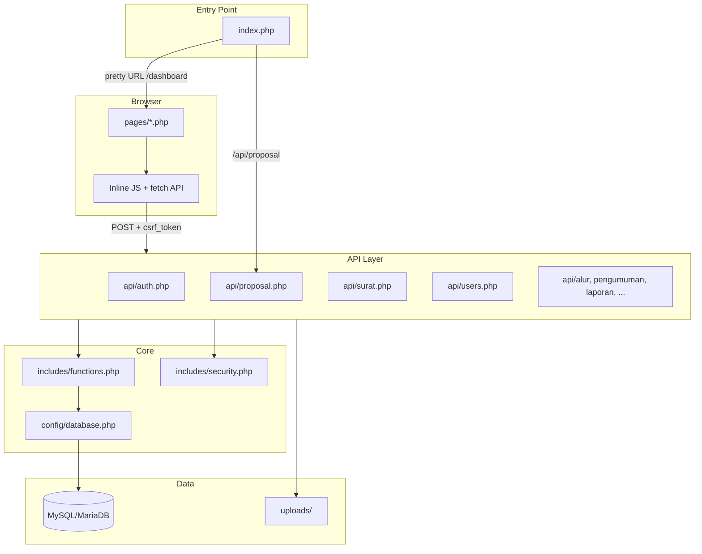
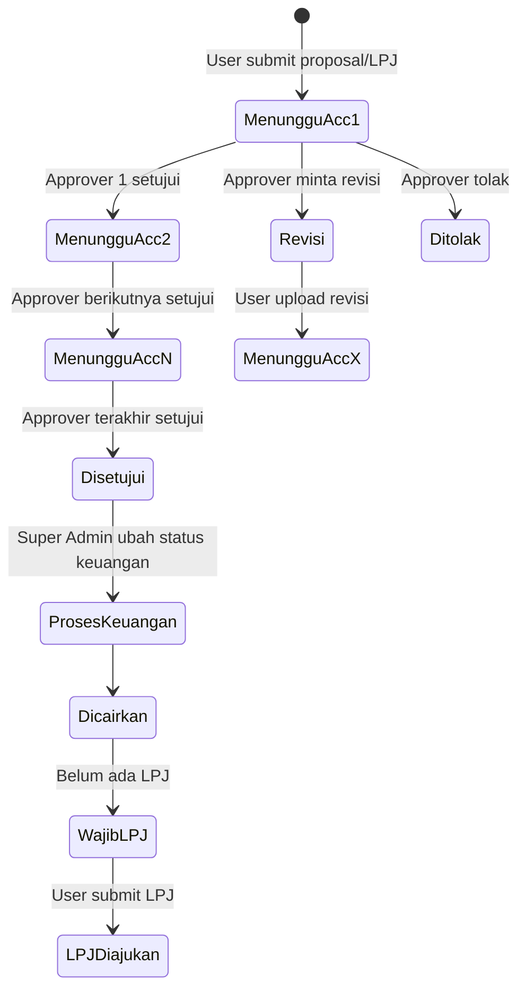
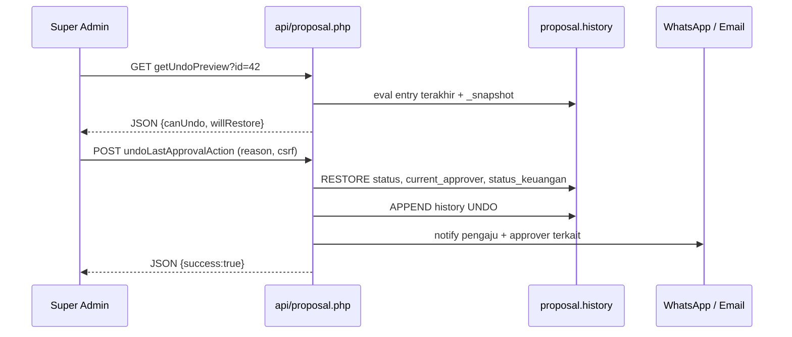
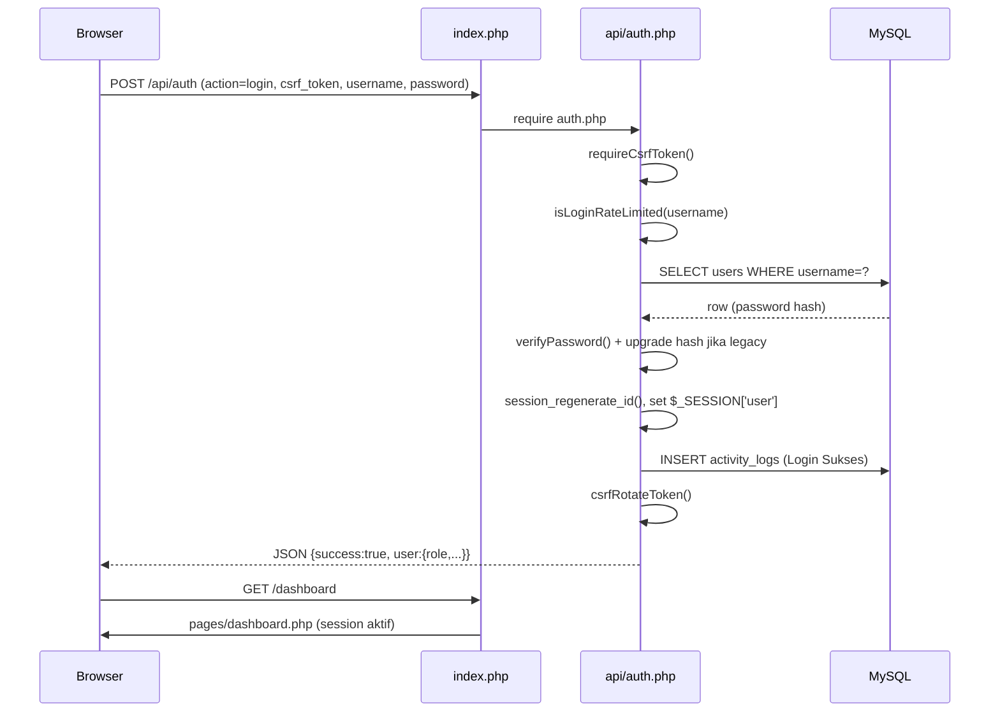
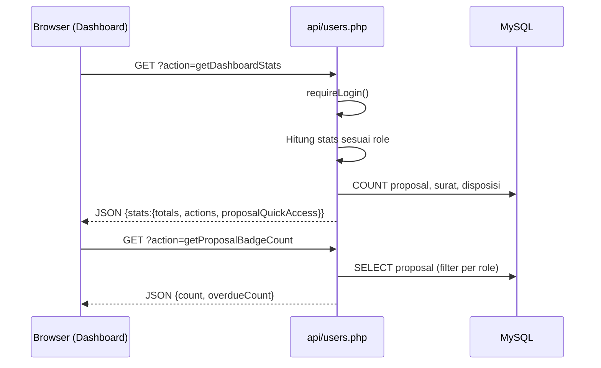
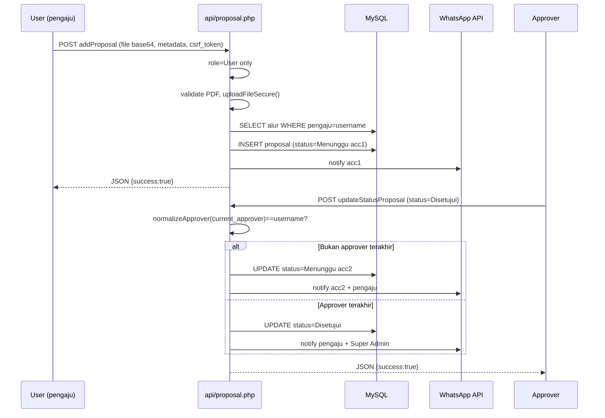
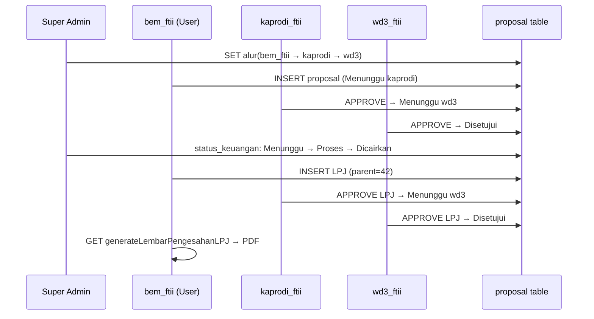

# Arsitektur LK UKMs — Dokumentasi Sistem

Sistem Proposal & LPJ LK UKMs adalah aplikasi **native PHP tanpa framework** untuk mengelola proposal, LPJ, surat, disposisi, dan alur persetujuan organisasi mahasiswa (UKM) UNISBANK.

---

## 1. Arsitektur Inti

### 1.1 Diagram komponen



### 1.2 Struktur direktori

| Layer | Lokasi | Fungsi |
|-------|--------|--------|
| Entry | `index.php` | Routing pretty URL, guard login, guard role halaman |
| Halaman | `pages/*.php` | View + JS inline; include `header` → `sidebar` → konten |
| API | `api/*.php` | Operasi CRUD via AJAX, return JSON (kecuali PDF/Excel) |
| Layout | `templates/` | Header (CSRF, Tailwind), sidebar (menu per role), footer (toast) |
| Modal | `modals/surat.php` | Dialog surat, di-include `pages/surat_masuk.php` |
| Core | `includes/functions.php` | DB helpers, approval chain, upload, notifikasi WA/email |
| Keamanan | `includes/security.php` | CSRF, bcrypt, rate limit login, `requireRole()`, CORS API (`applyApiCorsHeaders`), redirect halaman (`redirectUnlessPageRole`) |
| Email | `includes/email.php` | PHPMailer/Gmail SMTP |
| Skema | `config/schema.sql` | Definisi tabel otoritatif |
| Upload | `uploads/{kategori}_{username}/` | File user dengan prefix `uniqid()` |

### 1.3 Alur request

1. Request masuk ke `index.php`
2. Jika URI dimulai `api/*` → load file API langsung, `exit`
3. Jika bukan login dan belum auth → redirect `/login`
4. Resolve halaman dari path (`/proposal`) atau `?page=`
5. Guard khusus untuk role `Disposisi` dan `Read Only`
6. Load `pages/{page}.php`

### 1.4 Routing

**API routes** (terdaftar di `index.php`):

- `api/auth`, `api/users`, `api/surat`, `api/proposal`
- `api/penggunaan_ruangan`, `api/alur`, `api/pengumuman`
- `api/arsip`, `api/laporan`

**Page routes** (`$validPages` di `index.php`):

`dashboard`, `surat_masuk`, `surat_keluar`, `disposisi`, `proposal`, `arsip`, `arsip_proposal`, `users`, `profil`, `monitoring`, `alur`, `system_settings`, `pengumuman`, `activity_logs`, `penggunaan_ruangan`, `laporan`, `login`

`surat_keluar` di-redirect ke `surat_masuk` (digabung dalam satu halaman).

### 1.5 Pola keamanan

- **Session-based auth** — role di `$_SESSION['user']` dari DB saat login, tidak pernah dipercaya dari client
- **CSRF** — `window.csrfToken` di `templates/header.php`; semua POST API wajib `csrf_token`
- **Prepared statements** — semua query DB
- **Dual guard** — UI (sidebar/page) + API (`requireRole()`)
- **Normalisasi approver** — `normalizeApprover()` memperlakukan spasi dan underscore setara (`bem ftii` == `bem_ftii`)

### 1.6 Frontend stack

- Tailwind CSS CDN (tema maroon `#8B1538`)
- Font Awesome 6.4
- Chart.js (dashboard, monitoring)
- Toast global `showToast()` di `templates/footer.php`
- TCPDF + QR code untuk PDF pengesahan

---

## 2. Model Role & Hak Akses

### 2.1 Role yang tersedia

`Super Admin`, `Admin`, `User`, `Approver`, `Disposisi`, `Read Only`

### 2.2 Matriks menu sidebar

| Menu | Super Admin | Admin | User (Pengaju) | Approver | Disposisi | Read Only |
|------|:-----------:|:-----:|:--------------:|:--------:|:---------:|:---------:|
| Dashboard | ✓ | ✓ | ✓ | ✓ | ✓ | ✓ |
| Surat | ✓ | ✓ | ✓ | ✗ | ✓ | ✓ |
| Disposisi | ✓ | ✓ | ✓ | ✓ | ✓ | ✓ |
| Proposal & LPJ | ✓ | ✓ | ✓ | ✓ | ✗ | ✓ |
| Jadwal Ruangan | ✓ | ✗ | ✓ | ✓ | ✗ | ✗ |
| Monitoring | ✓ | ✓ | ✗ | ✗ | ✗ | ✗ |
| Laporan | ✓ | ✓ | ✗ | ✗ | ✗ | ✗ |
| Pengumuman | ✓ | ✓ | ✓ | ✗ | ✗ | ✗ |
| Activity Logs | ✓ | ✓ | ✗ | ✗ | ✗ | ✗ |
| Arsip Proposal | ✓ | ✗ | ✗ | ✗ | ✗ | ✗ |
| Kelola Users | ✓ | ✗ | ✗ | ✗ | ✗ | ✗ |
| Kelola Alur | ✓ | ✗ | ✗ | ✗ | ✗ | ✗ |
| Pengaturan Sistem | ✓ | ✗ | ✗ | ✗ | ✗ | ✗ |
| Profil | ✓ | ✓ | ✓ | ✓ | ✓ | ✓ |

### 2.3 Guard halaman di router (`index.php`)

- **Disposisi** — hanya: `dashboard`, `surat_masuk`, `disposisi`, `profil`, `login`
- **Read Only** — hanya: `dashboard`, `surat_masuk`, `disposisi`, `proposal`, `profil`, `login`

Halaman eksklusif Super Admin (`users`, `alur`, `system_settings`, `arsip_proposal`) dilindungi di level page dengan redirect ke dashboard.

### 2.4 Database — tabel utama

| Tabel | Fungsi |
|-------|--------|
| `users` | Akun, role, kontak, `force_change` |
| `proposal` | Proposal & LPJ (dibedakan `jenis`), approval state, keuangan |
| `proposal_revision_history` | Riwayat revisi per approver |
| `alur` | Rantai approver per pengaju (acc1–acc6) |
| `surat_masuk` / `surat_keluar` | Surat masuk & keluar |
| `surat_disposisi` | Disposisi surat |
| `pengumuman` | Pengumuman sistem |
| `penggunaan_ruangan` | Jadwal ruangan |
| `arsip` | Arsip dokumen umum |
| `activity_logs` | Audit trail |
| `system_config` | Toggle fitur & konfigurasi AI |

---

## 3. Alur Kerja Proposal & LPJ

### 3.1 Siklus hidup dokumen



### 3.2 Rantai persetujuan

- Setiap **pengaju** (username UKM, role `User`) punya hingga **6 approver** (`acc1`–`acc6`) di tabel `alur`
- Dikelola Super Admin di `/alur` via `api/alur.php`
- Saat submit: `current_approver = acc1`, `status = "Menunggu {acc1}"`
- Jika tidak ada alur: fallback approver = `Admin`
- `findApproverUsers()` resolve approver: username → role → name (first match)

### 3.3 Filter data per role (`getProposals`)

| Role | Proposal yang terlihat |
|------|------------------------|
| **User** | Hanya milik sendiri (`pengaju = username`) |
| **Approver** | Proposal pengaju di chain alur mereka; `ketua-dpm` bisa lihat semua `Disetujui` |
| **Admin** | Proposal di chain mereka ATAU milik sendiri |
| **Super Admin** | Semua |
| **Read Only** | Semua (read-only) |

### 3.4 Aksi per role di Proposal

| Aksi | User | Approver | Admin | Super Admin |
|------|:----:|:--------:|:-----:|:-----------:|
| Tambah Proposal/LPJ | ✓ | ✗ | ✗ | ✗ |
| Setujui / Tolak / Revisi | ✗ | ✓ (hanya giliran sendiri) | ✓ | ✓ |
| Upload revisi | ✓ | ✗ | ✓ | ✓ |
| Edit anggaran | ✗ | ✗ | ✓ | ✓ |
| Ubah status keuangan | ✗ | ✗ | ✗ | ✓ |
| Edit tanggal pelaksanaan | ✗ | ✗ | ✗ | ✓ |
| Hapus proposal | ✗ | ✗ | ✗ | ✓ |
| Generate lembar pengesahan | ✓ (milik sendiri) | ✗ | ✗ | ✓ (+ ketua-dpm) |
| Kirim reminder | ✗ | ✗ | ✗ | ✓ |
| Kembalikan keputusan approval (undo) | ✗ | ✗ | ✗ | ✓ |
| Analisis AI dokumen | ✗ | ✗ | ✓ | ✓ |

### 3.5 LPJ

- Wajib link ke proposal parent yang **sudah dicairkan** (`status_keuangan = Dicairkan`)
- Satu proposal hanya boleh punya satu LPJ
- Tab **Wajib LPJ** menampilkan proposal dicairkan tanpa LPJ

### 3.6 Status keuangan

`Menunggu` → `Proses Keuangan` → `Dicairkan` — hanya Super Admin via `updateProposalFinancialStatus`.

### 3.7 Notifikasi

- **WhatsApp** via `https://wa.dwibudi.my.id/instances/{instanceId}/messages`
- **Email** via PHPMailer/Gmail SMTP
- Dipicu: submit proposal, approval, revisi, disposisi, final approval, **pembatalan approval (undo)**

### 3.8 Pembatalan keputusan approval (undo)

Fitur untuk kasus approver salah klik **Setujui / Revisi / Tolak**. Hanya **Super Admin**; tanpa batas waktu; notifikasi WA/email **wajib**.

#### Mekanisme

1. Setiap keputusan baru via `updateStatusProposal` (setelah deploy fitur) menyimpan `_snapshot` di entry `history`:
   - `status`, `current_approver`, `status_keuangan` **sebelum** aksi
2. `undoLastApprovalAction` memulihkan state dari snapshot entry **terakhir** yang undoable
3. Entry audit `UNDO` ditambahkan ke `history` (riwayat tidak dihapus)
4. Notifikasi ke: pengaju, approver yang keputusannya dibatalkan, approver yang kembali jadi giliran (jika berbeda)

#### Syarat undo diizinkan

| Kondisi | Hasil |
|---------|-------|
| Entry terakhir = `Disetujui` / `Revisi` / `Ditolak` dengan `_snapshot` | Boleh |
| Keputusan dibuat sebelum deploy (tanpa `_snapshot`) | Ditolak |
| Sudah ada aksi lain setelah keputusan (upload revisi, edit keuangan, dll.) | Ditolak |
| Status `Disetujui` + `status_keuangan` ≠ `Menunggu` | Ditolak |
| Undo `Revisi` + pengaju sudah upload revisi | Ditolak (entry terakhir bukan Revisi) |

#### API & UI

| Endpoint | Method | Guard |
|----------|--------|-------|
| `getUndoPreview` | GET | Super Admin |
| `undoLastApprovalAction` | POST+CSRF | Super Admin; `reason` wajib |

UI: tombol **Kembalikan Approval** di dropdown & detail proposal (`pages/proposal.php`); preview state sebelum konfirmasi.



---

## 4. Diagram Sequence — Per Endpoint API

Endpoint diakses via `/api/{modul}?action=...`. Semua API (kecuali login) membutuhkan session cookie; POST wajib `csrf_token`.

### 4.1 Autentikasi — `api/auth.php`

| Action | Method | Guard | Response |
|--------|--------|-------|----------|
| `login` | POST | CSRF | JSON `{success, user, needsPasswordChange}` |
| `logout` | POST | CSRF | JSON |
| `checkSession` | POST | — | JSON status session |
| `getCsrfToken` | POST | — | JSON token baru |



### 4.2 Users & Dashboard — `api/users.php`

| Action | Method | Role Guard |
|--------|--------|------------|
| `getUsers` | GET | Super Admin, Admin |
| `getUser` | GET | Super Admin, Admin |
| `getActivityLogs` | GET | Super Admin, Admin |
| `getDashboardStats` | GET | Semua login (data difilter per role) |
| `getProposalBadgeCount` | GET | Semua login |
| `getActiveUserTrend` | GET | Super Admin, Admin |
| `getSystemSettings` | GET | Super Admin |
| `addUser` | POST+CSRF | Super Admin |
| `updateUserByAdmin` | POST+CSRF | Super Admin |
| `deleteUser` | POST+CSRF | Super Admin |
| `resetUserPassword` | POST+CSRF | Super Admin, Admin |
| `updateUserProfile` | POST+CSRF | Semua (profil sendiri) |
| `changeOwnPassword` | POST+CSRF | Semua |
| `saveSystemSettings` | POST+CSRF | Super Admin |
| `sendLoginInfoWA` | POST+CSRF | Super Admin |



#### 4.2.1 Dashboard — `pages/dashboard.php`

Halaman `/dashboard` adalah **command center operasional** per role (fokus aksi & antrian). Halaman `/monitoring` terpisah untuk analitik/chart real-time. Data dimuat via `GET api/users?action=getDashboardStats`; frontend memanggil pretty URL (bukan `api/users.php` langsung).

**Prinsip desain:**

- Super Admin = pusat kendali global (antrian keuangan, kesehatan alur, administrasi)
- Admin = antrian scoped chain approval + milik sendiri (bukan duplikat scope SA)
- Approver / User / Disposisi / Read Only = layout ringkas tanpa fitur eksklusif SA

**Response `getDashboardStats` (field utama):**

| Field | Role | Keterangan |
|-------|------|------------|
| `scopeLabel` | Semua | Label konteks data (mis. total vs scoped) |
| `totals` | Semua* | Counter surat, proposal, keuangan (*sesuai role) |
| `actions` | Semua* | Counter prioritas (proposalNeedsAction, revisi, disposisi, surat) |
| `proposalQuickAccess` | Semua kecuali Disposisi | `menungguReview`, `perluRevisi`, `baruDisubmit`, `actionTotal` |
| `announcements` | Semua | 5 pengumuman terbaru |
| `recentActivity` | Admin, Super Admin | 10 log terbaru (UI tampilkan 5 + link `/activity_logs`) |
| `trends` | Admin, Super Admin | Perbandingan 30 vs 31–60 hari (badge di kartu Ringkasan) |
| `weeklyTrend` | Admin, Super Admin | 7 hari: `labels`, `submitted`, `approved` (Chart.js di Ringkasan) |
| `activeToday` | Admin, Super Admin | User unik login sukses hari ini |
| `superAdminQueue` | Super Admin | `keuanganMenunggu`, `prosesKeuangan`, `wajibLpj`, `overdue` |
| `adminQueue` | Admin | `menungguReview`, `perluRevisi`, `overdue`, `baruDisubmit` (scoped) |
| `headlineSummary` | Super Admin, Admin | Satu baris ringkasan urgent di hero |
| `systemHealth` | Super Admin | `ukmTanpaAlur`, `approverTidakResolve` |

**Helper backend** (`includes/functions.php`):

| Fungsi | Scope |
|--------|-------|
| `loadAlurChainMap()` | Map `pengaju` → chain `acc1`–`acc6` (normalized) |
| `isProposalInAdminScope()` | Admin: proposal di chain ATAU `pengaju = username` |
| `calculateSuperAdminDashboardQueue()` | Antrian keuangan/LPJ/overdue global |
| `calculateAdminDashboardQueue()` | Antrian proposal scoped Admin |
| `buildSuperAdminDashboardHeadline()` / `buildAdminDashboardHeadline()` | Teks hero dinamis |
| `calculateProposalWeeklyTrend()` | Submit (non-LPJ) vs approval log 7 hari |
| `calculateDashboardSystemHealth()` | UKM tanpa alur + approver tidak resolve |
| `calculateProposalQuickAccessCounts()` | Counter akses cepat & badge sidebar |

**Filter proposal Admin** di `getDashboardStats` dan `calculateProposalQuickAccessCounts` mengikuti aturan yang sama dengan `getProposals` (§3.3): hanya baris yang lolos `isProposalInAdminScope()`.

**Layout per role (urutan section):**

| Role | Section khas | Catatan |
|------|--------------|---------|
| **Super Admin** | Pusat Kendali → Antrian SA → Kesehatan Sistem → Prioritas Sistem → Ringkasan (collapsible, default collapsed, preferensi `sessionStorage` `dashboard_stats_expanded`) → Aksi Cepat (Operasional + Administrasi) | Tanpa duplikat proposal menunggu di Ringkasan |
| **Admin** | Dashboard Operasional → Antrian Admin → Prioritas Sistem (disposisi + surat) → Ringkasan + chart 7 hari → Aksi Cepat (Monitoring, Laporan, Pengumuman, Surat) | Tanpa Users/Alur/Settings; tanpa panel keuangan SA |
| **Approver** | Hero → **Prioritas Saya** (`order-1`) → Ringkasan → Aksi Cepat | 3 kartu: menunggu, revisi, baru disubmit; tanpa section Akses Cepat Proposal |
| **User** | Butuh Tindakan → Akses Cepat Proposal → Ringkasan (termasuk keuangan milik sendiri) | Layout standar pengaju |
| **Disposisi** | Butuh Tindakan (disposisi + surat) | Tanpa proposal & tanpa kartu keuangan |
| **Read Only** | Butuh Tindakan + Ringkasan proposal/surat | Tanpa subgroup Keuangan di Ringkasan |

**Deep link kartu antrian/prioritas** (query di `pages/proposal.php` / `pages/disposisi.php`):

- Keuangan menunggu → `/proposal?status=disetujui&fin=menunggu`
- Proses keuangan → `/proposal?fin=proses`
- Wajib LPJ → `/proposal?tab=wajib_lpj`
- Overdue → `/proposal?overdue=1`
- Menunggu / revisi → `/proposal?status=menunggu` / `?status=revisi`
- Disposisi terbuka → `/disposisi?status=open`

**Perilaku frontend:**

- `loadDashboardData()` — muat penuh; `refreshActionsOnly()` — auto-refresh 60 detik (hanya counter aksi/antrian)
- `setDashboardLastUpdated()` — timestamp di header Antrian SA/Admin & Prioritas Sistem
- Severity border kartu aksi: `urgent` / `warning` / `info` / `neutral`
- Chart.js sudah di `templates/header.php`; grafik tren graceful fallback jika data kosong

**Tasklist implementasi:** `TASKLIST-DASHBOARD-IMPROVEMENT.md` (Fase 1–4 selesai 2026-06-15).

### 4.3 Proposal & LPJ — `api/proposal.php`

| Action | Method | Role / Guard |
|--------|--------|--------------|
| `getProposals` | GET | User, Approver, Admin, Super Admin, Read Only |
| `getArchivePengaju` | GET | Super Admin |
| `getArchiveByPengaju` | GET | Super Admin |
| `getApprovalChain` | GET | User (milik sendiri), Approver/Admin (di chain), Super Admin, Read Only |
| `generateLembarPengesahan` | GET | Owner / Super Admin / ketua-dpm → PDF |
| `generateLembarPengesahanLPJ` | GET | Owner / Super Admin / ketua-dpm → PDF |
| `addProposal` | POST+CSRF | User saja |
| `updateStatusProposal` | POST+CSRF | Admin, Super Admin, Approver (giliran); menyimpan `_snapshot` di `history` |
| `getUndoPreview` | GET | Super Admin |
| `undoLastApprovalAction` | POST+CSRF | Super Admin; `reason` wajib |
| `reviseProposal` | POST+CSRF | Owner atau Admin/Super Admin |
| `sendReminder` | POST+CSRF | Super Admin |
| `editProposalByAdmin` | POST+CSRF | Admin, Super Admin |
| `updateProposalFinancialStatus` | POST+CSRF | Super Admin |
| `editProposalTanggalPelaksanaan` | POST+CSRF | Super Admin |
| `deleteProposal` | POST+CSRF | Super Admin |
| `analyzeProposal` | POST+CSRF | Owner, Admin, Super Admin |
| `extractTextProposal` | POST+CSRF | Owner, Super Admin |
| `continueAnalysisProposal` | POST+CSRF | Owner, Admin, Super Admin |



### 4.4 Surat — `api/surat.php`

| Action | Method | Role Guard |
|--------|--------|------------|
| `getSuratMasuk` | GET | Admin/SA/Disposisi/RO = semua; User = owner=me |
| `getSuratKeluar` | GET | Admin/SA = semua; User = created_by=me |
| `getDisposisiBySurat` | GET | Privileged atau terkait surat |
| `getDisposisiList` | GET | Super Admin = global; lain = inbox/sent |
| `getMonitoringSurat` | GET | Admin, Super Admin |
| `generatePengesahanSurat` | GET | Admin, Super Admin → PDF |
| `addSuratMasuk` | POST+CSRF | Admin, Super Admin |
| `addSuratKeluar` | POST+CSRF | User |
| `addDisposisiSurat` | POST+CSRF | Super Admin |
| `updateDisposisiStatus` | POST+CSRF | Penerima / Super Admin |
| `reviseSuratKeluar` | POST+CSRF | User (owner) |
| `updateStatusSurat` | POST+CSRF | Admin, Super Admin |
| `deleteSuratMasuk/Keluar` | POST+CSRF | Super Admin |

**Catatan UI:** Halaman `surat_masuk.php` menampilkan **Surat Keluar** untuk role `User`, **Surat Masuk** untuk role lain.

### 4.5 Alur — `api/alur.php`

Seluruh file: **Super Admin only**.

| Action | Method |
|--------|--------|
| `getAlur`, `getApproverUsers`, `getUKMUsers` | GET |
| `addAlur`, `updateAlur`, `deleteAlur` | POST+CSRF |

### 4.6 Pengumuman — `api/pengumuman.php`

| Action | Method | Role |
|--------|--------|------|
| `getAnnouncements` | GET | Semua login |
| `addAnnouncement` | POST+CSRF | Admin, Super Admin |
| `deleteAnnouncement` | POST+CSRF | Super Admin |

### 4.7 Arsip — `api/arsip.php`

| Action | Method | Role |
|--------|--------|------|
| `getArsipData` | GET | Super Admin, Admin |
| `addArsipData` | POST+CSRF | Super Admin, Admin |
| `deleteArsip` | POST+CSRF | Super Admin |
| `analyzeArsip`, `extractTextArsip`, `continueAnalysisArsip` | POST+CSRF | Owner, Admin, Super Admin |

### 4.8 Penggunaan Ruangan — `api/penggunaan_ruangan.php`

| Action | Method | Role |
|--------|--------|------|
| `getPenggunaanRuangan` | GET | Super Admin, User, Approver |
| `addPenggunaanRuangan` | POST+CSRF | Super Admin |
| `updatePenggunaanRuangan` | POST+CSRF | Super Admin |

### 4.9 Laporan — `api/laporan.php`

File-level guard: `requireRole(['Admin', 'Super Admin'])`.

| Action | Method |
|--------|--------|
| `getLaporanMeta`, `getLaporanData` | GET |
| `downloadExcel` | GET → stream Excel |

### 4.10 Akses API & bootstrap

- Pretty URL wajib: `/api/users`, `/api/proposal`, dll.
- Akses langsung `/api/*.php` diblok: `.htaccess` (Apache) + `api/bootstrap.php` (semua file API, termasuk nginx).
- WhatsApp: hanya internal `sendWhatsAppNotification()` atau CLI `php test_wa.php` — tidak ada endpoint HTTP publik.

### 4.11 Kebijakan CORS API (P3)

Semua file di `api/*.php` memakai helper terpusat di `includes/security.php`:

| Helper | Fungsi |
|--------|--------|
| `getAllowedApiOrigins()` | Allowlist: `http://localhost`, `http://127.0.0.1`, `scheme://HTTP_HOST`, env `CORS_ALLOWED_ORIGINS` |
| `applyApiCorsHeaders()` | Reflect `Origin` hanya jika di allowlist; **tidak pernah** `Access-Control-Allow-Origin: *` |
| `applyApiSecurityHeaders()` | `X-Content-Type-Options`, `X-Frame-Options`, dll. |
| `handleApiPreflightRequest()` | `OPTIONS` → HTTP 204 |

**Konfigurasi opsional** (staging / domain tambahan):

```bash
CORS_ALLOWED_ORIGINS=https://staging.example.com,https://app.example.com
```

Verifikasi: `php scripts/verify_security_p0.php [base_url]` — termasuk tes origin jahat dan absence of wildcard.

---

## 5. Audit Keamanan & Inkonsistensi Guard Role

### 5.1 Temuan kritis (status perbaikan)

| Temuan | Status | Perbaikan |
|--------|--------|-----------|
| IDOR `getUser` | **Selesai** | `requireRole(['Super Admin','Admin'])` di `api/users.php` |
| `api/wa_send.php` tanpa auth | **Selesai** | File dihapus; WA via internal + CLI `test_wa.php` |
| Akses langsung `api/*.php` | **Selesai** | `.htaccess` + `api/bootstrap.php` |
| Abuse WA | **Selesai** | Rate limit 50 pesan / 15 menit per user/IP di `sendWhatsAppNotification()` |

Detail tasklist: `TASKLIST-KEAMANAN-KRITIS.md`

### 5.2 Temuan sedang

| # | Masalah | Lokasi | Dampak |
|---|---------|--------|--------|
| 1 | ~~Page guard tidak seragam~~ | `monitoring.php`, `arsip.php` | **Selesai (P1)** — guard di page + `index.php` |
| 2 | ~~Redirect JS vs HTTP~~ | halaman privileged | **Selesai (P2)** — `redirectUnlessPageRole()` + `index.php` |
| 3 | ~~`getApprovalChain` terbuka~~ | `api/proposal.php` | **Selesai (P1)** — filter per role |
| 4 | ~~`addArsipData` tanpa role~~ | `api/arsip.php` | **Selesai (P1)** — Admin/Super Admin only |
| 5 | Admin bypass giliran approval | `updateStatusProposal` | Admin/SA approve tanpa cek `current_approver` |
| 6 | ~~CORS `Access-Control-Allow-Origin: *`~~ | Beberapa API | **Selesai (P3)** — `applyApiCorsHeaders()` allowlist; env `CORS_ALLOWED_ORIGINS` |
| 7 | PDF GET tanpa CSRF | `generateLembarPengesahan` | Umum untuk download; aman jika session-only |
| 8 | ~~`activity_logs.php` pakai `requireRole()` di page~~ | **Selesai (P2)** — HTTP redirect |

### 5.3 Inkonsistensi UI vs API

| Fitur | Sidebar | Page guard | API guard | Status |
|-------|---------|------------|-----------|--------|
| Monitoring | Admin, SA | ✓ index + page | API individual 403 | OK |
| Kelola Users | SA only | ✓ index + page (302) | ✓ | OK |
| Laporan | Admin, SA | ✓ HTTP redirect | ✓ file-level | OK |
| Arsip | Tidak di sidebar | ✓ index + page | ✓ API Admin/SA | OK (admin only) |
| Proposal (Disposisi) | Hidden | ✓ index.php | ✓ getProposals 403 | OK |
| Jadwal Ruangan (Admin) | Hidden | ✓ page redirect | ✓ API 403 | OK |

### 5.4 Yang sudah baik

- Session role tidak pernah dipercaya dari client
- CSRF wajib di hampir semua POST mutasi data
- Prepared statements konsisten
- Rate limit login (5 percobaan / 15 menit)
- Password bcrypt + auto-upgrade legacy plaintext
- Approver dicek `normalizeApprover()` di API dan frontend
- Activity logging dengan redaksi payload sensitif
- CORS API ketat — allowlist origin, tanpa wildcard (P3)
- Redirect HTTP 302 untuk halaman privileged via `redirectUnlessPageRole()` (P2)
- Audit trail approval dengan `_snapshot` + entry `UNDO` untuk koreksi kesalahan approver

### 5.5 Prioritas perbaikan

```
[x] P0  getUser IDOR + wa_send.php + bootstrap api (selesai 2026-06-15)
[x] P1  Page guard monitoring, arsip; getApprovalChain; arsip API (selesai 2026-06-15)
[x] P2  Seragamkan redirect (HTTP 302) untuk halaman privileged (selesai 2026-06-15)
[x] P3  CORS policy ketat — allowlist origin, tanpa wildcard (selesai 2026-06-15)
```

---

## 6. Dokumentasi Onboarding Per Role

### 6.1 Super Admin — Setup awal sistem

**Tujuan:** Sistem siap dipakai UKM dan approver.

#### Hari 1 — Infrastruktur

1. `composer install` di server
2. Buka `/install.php` → buat database & tabel
3. Login default: `superadmin` / `admin123` → **segera ganti password**
4. Buka **Pengaturan Sistem** (`/system_settings`):
   - `SYSTEM_NAME`, `SYSTEM_DESC`
   - `OPEN_SURAT`
   - Konfigurasi AI (opsional)
   - `PROPOSAL_PENDING_THRESHOLD_DAYS`

#### Hari 2 — Manajemen user

1. **Kelola Users** (`/users`) → tambah akun:
   - UKM → role `User`
   - Pejabat penyetuju → role `Approver`
   - Staff LK → role `Admin`
   - Petugas disposisi → role `Disposisi`
2. Isi **phone** dan **email** — dipakai notifikasi
3. Isi **sebutan** (Bapak/Ibu)
4. Kirim kredensial via **Kirim Info Login WA**

#### Hari 3 — Alur approval

1. **Kelola Alur** (`/alur`) → untuk setiap username UKM:
   - `pengaju` = username UKM
   - `acc1`–`acc6` = username approver (urutan = urutan approval)
2. Uji: login sebagai UKM → submit proposal dummy → cek notifikasi ke acc1

#### Operasional rutin

| Tugas | Menu | Frekuensi |
|-------|------|-----------|
| Monitor antrian | Dashboard (Pusat Kendali: Antrian SA, Kesehatan Sistem) / Monitoring | Harian |
| Ubah status keuangan | Proposal → detail | Per proposal disetujui |
| Disposisi surat | Surat Masuk | Saat surat masuk |
| Approve surat keluar UKM | Surat | Saat ada pengajuan |
| Reminder stuck proposal | Proposal → ikon bell | Mingguan |
| Koreksi salah approval | Proposal → Kembalikan Approval | Saat approver salah klik setuju/revisi/tolak |
| Input jadwal ruangan | Jadwal Ruangan | Sesuai kebutuhan |
| Arsip & laporan | Arsip Proposal / Laporan | Bulanan |

---

### 6.2 Admin — Operator harian

**Akses:** Monitoring, Laporan, Surat, Proposal (terbatas), Pengumuman, Activity Logs.

#### Checklist pertama kali login

1. Ganti password di **Profil**
2. Buka **Dashboard** → panel **Antrian Admin** (scope chain Anda) + **Prioritas Sistem** (disposisi/surat)
3. Buka **Monitoring** → pantau proposal pending global

#### Tugas utama

- **Surat Masuk:** input surat manual, pantau status
- **Surat Keluar UKM:** review & setujui/tolak/revisi
- **Proposal:** lihat proposal di chain + milik sendiri; edit anggaran; approve (override giliran)
- **Pengumuman:** buat pengumuman untuk UKM
- **Laporan:** export Excel

#### Yang tidak bisa dilakukan Admin

- Kelola users, alur, pengaturan sistem
- Ubah status keuangan, hapus proposal
- Buat disposisi surat
- Input jadwal ruangan

---

### 6.3 Approver — Penyetuju proposal

**Fokus:** Review proposal di rantai alur mereka.

#### Checklist pertama kali login

1. Ganti password di **Profil**
2. Pastikan **phone/email** benar
3. Buka **Dashboard** → section **Prioritas Saya** (menunggu, revisi, baru disubmit) di atas fold
4. Buka **Proposal & LPJ** → filter **Prioritas Saya** untuk detail

#### Cara kerja review

1. Badge merah di sidebar = proposal menunggu giliran Anda
2. Buka detail → baca PDF
3. Aksi: **Disetujui** / **Revisi** (wajib catatan) / **Ditolak**
4. Hanya bisa approve saat `current_approver` = username Anda

#### Menu lain

- Disposisi (jika ditugaskan)
- Jadwal Ruangan (read-only)
- Tidak ada: Surat, Pengumuman, Monitoring

---

### 6.4 User (Pengaju UKM)

**Fokus:** Ajukan proposal, pantau approval, submit LPJ setelah dicairkan.

#### Checklist pertama kali login

1. Ganti password
2. Lengkapi **Profil** (phone, email)
3. Konfirmasi **alur approval** sudah dikonfigurasi untuk username Anda

#### Mengajukan Proposal

1. **Proposal & LPJ** → **Tambah Proposal**
2. Isi metadata + upload PDF (wajib, max 10MB)
3. Submit → status `Menunggu {acc1}`

#### Jika diminta Revisi

1. Filter **Perlu Revisi** → upload PDF baru + catatan
2. Status kembali ke `Menunggu {approver yang minta revisi}`

#### Setelah Proposal Disetujui Final

1. Tunggu Super Admin: `Proses Keuangan` → `Dicairkan`
2. Tab **Wajib LPJ** → submit LPJ dengan parent proposal dicairkan
3. LPJ melewati chain approval yang sama

#### Surat Keluar

Menu **Surat** (UI: Surat Keluar) → **Kirim Surat Keluar** → pantau status

#### Generate dokumen

Setelah proposal/LPJ **Disetujui**: **Lembar Pengesahan** (PDF)

---

### 6.5 Role tambahan

| Role | Onboarding singkat |
|------|-------------------|
| **Disposisi** | Fokus Disposisi + Surat Masuk; tidak akses Proposal |
| **Read Only** | Baca Surat, Disposisi, Proposal; tidak bisa update disposisi |

---

## 7. Trace Flow Konkret — End-to-End

Skenario: UKM **bem_ftii** mengajukan proposal, melewati 2 approver, dicairkan, lalu submit LPJ.

### 7.1 Prasyarat (setup Super Admin)

```
users:
  bem_ftii      → role: User
  kaprodi_ftii  → role: Approver
  wd3_ftii      → role: Approver

alur:
  pengaju: bem_ftii
  acc1: kaprodi_ftii
  acc2: wd3_ftii
```

### 7.2 Langkah 1 — Login pengaju

```
POST /api/auth
  action=login, username=bem_ftii, password=***, csrf_token=...

→ $_SESSION['user'] = {role:'User', username:'bem_ftii'}
→ activity_logs: "Login Sukses"
→ Redirect /dashboard
```

### 7.3 Langkah 2 — Submit proposal

```
POST /api/proposal
  action=addProposal
  nama_kegiatan="Seminar Nasional FTII 2026"
  jenis=Proposal, anggaran=15000000, file=<base64 PDF>
```

**Backend:**

1. Validasi role = `User`, validasi PDF
2. `getApprovalChain('bem_ftii')` → `[kaprodi_ftii, wd3_ftii]`
3. INSERT `proposal`:
   - `status` = `"Menunggu kaprodi_ftii"`
   - `current_approver` = `kaprodi_ftii`
4. WA/email ke `kaprodi_ftii`

### 7.4 Langkah 3 — Approver 1 menyetujui

```
POST updateStatusProposal id=42 status=Disetujui note="Anggaran sesuai"
```

- Cek giliran: `normalizeApprover('kaprodi_ftii') == current_approver` ✓
- UPDATE: `status = "Menunggu wd3_ftii"`, `current_approver = wd3_ftii`
- Notify `wd3_ftii` + `bem_ftii`

### 7.5 Langkah 4 — Approver 2 menyetujui (final)

```
POST updateStatusProposal id=42 status=Disetujui
```

- Approver terakhir → `status = Disetujui`, `current_approver = '-'`
- Notify `bem_ftii` + Super Admin

| Field | Nilai |
|-------|-------|
| status | Disetujui |
| current_approver | - |
| status_keuangan | Menunggu |

### 7.6 Langkah 5 — Super Admin proses keuangan

```
POST updateProposalFinancialStatus id=42 status_keuangan=Proses Keuangan
POST updateProposalFinancialStatus id=42 status_keuangan=Dicairkan
```

Tab **Wajib LPJ** aktif untuk `bem_ftii`.

### 7.7 Langkah 6 — Submit LPJ

```
POST addProposal jenis=LPJ parent_proposal_id=42 file=<base64 LPJ PDF>
```

Validasi: parent milik user, parent dicairkan, belum ada LPJ duplikat.

### 7.8 Langkah 7 — Generate lembar pengesahan

```
GET /api/proposal?action=generateLembarPengesahanLPJ&id=55
```

TCPDF stream PDF (bukan JSON).

### 7.9 Diagram ringkas



---

## 8. Peran Detail per Menu

### 8.1 Super Admin

Administrator penuh: users, alur, settings, arsip proposal, monitoring, laporan, disposisi global, status keuangan, jadwal ruangan (CRUD), reminder, undo keputusan approval, AI analysis.

### 8.2 Admin

Operator: monitoring, laporan, surat, proposal terbatas (chain + milik sendiri), pengumuman, activity logs. Bisa override approval dan edit anggaran.

### 8.3 Approver

Review proposal di chain alur. UI proposal sama User, tanpa menu Surat. Filter Prioritas Saya = antrian wajib.

### 8.4 User (Pengaju)

Satu-satunya role yang bisa tambah proposal/LPJ. Surat Keluar. Jadwal ruangan read-only.

### 8.5 Modul Surat

- Admin/SA/Disposisi/RO → semua surat masuk
- User → surat milik `owner`; UI fokus surat keluar
- Super Admin → disposisi, hapus, generate PDF

### 8.6 Modul Disposisi

- Dibuat Super Admin dari surat masuk
- Penerima update status (kecuali Read Only)
- Super Admin: view global

---

## 9. Referensi Cepat

| Dokumen | Isi |
|---------|-----|
| `CLAUDE.md` | Panduan developer utama |
| `AGENTS.md` | Aturan operasional agent |
| `TASKLIST-KEAMANAN-KRITIS.md` | Tasklist audit keamanan P0–P3 + verifikasi |
| `TASKLIST-DASHBOARD-IMPROVEMENT.md` | Tasklist perbaikan dashboard per role (Fase 1–4) |
| `config/schema.sql` | Skema database otoritatif |
| `install.php` | Instalasi database |
| `scripts/verify_security_p0.php` | Smoke test keamanan (P0–P3) |

**Default login dev:** `superadmin` / `admin123`

**Timezone:** Asia/Jakarta (`config/database.php`)

**Dependencies (Composer):** TCPDF, endroid/qr-code, PHPMailer

---

## 10. Riwayat Perubahan

### 2026-06-15 — Keamanan (P0–P3) & undo approval

| Area | Perubahan | File utama |
|------|-----------|------------|
| **P0** | IDOR `getUser` → Admin/SA only; hapus `api/wa_send.php`; blok akses langsung `api/*.php`; rate limit WA | `api/users.php`, `api/bootstrap.php`, `.htaccess`, `includes/security.php` |
| **P1** | Guard `monitoring`/`arsip`; filter `getApprovalChain`; role `getArsipData`/`addArsipData` | `index.php`, `api/proposal.php`, `api/arsip.php` |
| **P2** | Redirect HTTP 302 halaman privileged (`redirectUnlessPageRole`) | `includes/security.php`, `index.php`, `pages/*.php` |
| **P3** | CORS ketat — allowlist origin, tanpa `*`; env `CORS_ALLOWED_ORIGINS` | `includes/security.php`, semua `api/*.php` |
| **Fitur** | Undo keputusan approval terakhir (Super Admin); snapshot `_snapshot` di history; notifikasi wajib | `api/proposal.php`, `pages/proposal.php` |

**Keputusan desain undo:**

1. Hanya Super Admin
2. Tanpa batas waktu
3. Notifikasi WA/email wajib ke pengaju & approver terkait
4. Hanya keputusan baru setelah deploy (entry dengan `_snapshot`)

### 2026-06-15 — Dashboard per role (Fase 1–4)

| Fase | Perubahan | File utama |
|------|-----------|------------|
| **1** | Panel Antrian Super Admin; aksi cepat SA terpisah; deep link filter; `superAdminQueue` + `headlineSummary` | `api/users.php`, `pages/dashboard.php`, `includes/functions.php`, `pages/proposal.php`, `pages/disposisi.php` |
| **2** | Ringkasan SA collapsible; timestamp refresh; greeting time-of-day; aktivitas max 5 + ikon; severity kartu aksi | `pages/dashboard.php` |
| **3** | Visual selaras Monitoring; chart tren 7 hari; widget Kesehatan Sistem | `api/users.php`, `includes/functions.php`, `pages/dashboard.php` |
| **4** | Dashboard Admin scoped (`adminQueue`, `isProposalInAdminScope`); Approver Prioritas Saya; Read Only tanpa keuangan | `api/users.php`, `includes/functions.php`, `pages/dashboard.php` |

**Keputusan desain dashboard:**

1. Dashboard ≠ Monitoring — dashboard untuk **aksi**, monitoring untuk **analitik**
2. Super Admin tidak melihat angka proposal menunggu di lebih dari dua section (antrian + prioritas, bukan lagi di Ringkasan)
3. Admin melihat data proposal scoped chain; counter global hanya di Monitoring / Super Admin
4. Pretty URL API wajib di frontend (`api/users`, bukan `api/users.php`) — akses langsung diblok `.htaccess`