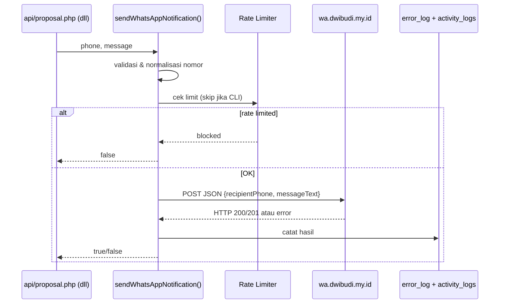

# Mekanisme Pengiriman WhatsApp — LK UKMs

Dokumen ini menjelaskan cara sistem LK UKMs mengirim notifikasi WhatsApp, untuk referensi implementasi di project lain.

## Arsitektur Singkat

WhatsApp **bukan endpoint publik**. Semua pengiriman lewat satu fungsi internal:

**`sendWhatsAppNotification($phone, $message)`** di `includes/functions.php`

Tidak ada `api/wa_send.php` (sudah dihapus/diblokir). Satu-satunya cara tes manual: CLI `php test_wa.php`.

---

## Gateway & Request HTTP

| Item | Nilai |
|------|-------|
| **Base URL** | `https://wa.dwibudi.my.id/instances/{instanceId}/messages` |
| **Instance ID** | `2e47ed5a-c719-4916-80e9-5e778e18e581` (hardcoded di `includes/functions.php`) |
| **Method** | `POST` via cURL |
| **Header** | `Content-Type: application/json` |
| **Body JSON** | `{ "recipientPhone": "...", "messageText": "..." }` |
| **Auth** | Tidak ada header API key / Bearer |
| **Timeout** | connect 5s, total 10s |
| **SSL** | `VERIFYPEER` dan `VERIFYHOST` dimatikan |

### Normalisasi Nomor

Sebelum dikirim, nomor dinormalisasi:

- `0812...` → `62812...`
- Tanpa prefix → ditambah `62`
- Hapus `+`, `-`, spasi
- Validasi minimal: nomor tidak kosong & panjang ≥ 5 karakter

### Response

- **Sukses** = HTTP `200` atau `201` → return `true`
- **Gagal** = selain itu atau error cURL → return `false`

---

## Rate Limiting

Implementasi di `includes/security.php`:

- **50 pesan / 15 menit** per actor
- Actor = `user:{username}` (jika login) atau `ip:{REMOTE_ADDR}`
- **CLI dikecualikan** (`PHP_SAPI === 'cli'` → actor `cli`, tidak kena limit)
- State disimpan di file JSON: `sys_get_temp_dir()/lkukm_wa_rate_limit/`

Jika limit tercapai, fungsi return `false` tanpa memanggil API.

---

## Logging

Setiap attempt dicatat ke:

1. **`error_log`** — JSON lengkap (phone, message, http_code, response, error)
2. **`activity_logs`** via `recordLogSystem()` — `"WA sent to {phone}"` atau `"WA failed to {phone}: HTTP {code}"`

---

## Pola Pesan

Helper yang dipakai bersama:

```php
// Salam: Bapak/Ibu dari kolom user.sebutan atau heuristik nama
$sebutan = getSebutan($name, $user['sebutan'] ?? '');

// Tambah panduan login + menu
$msg = appendNotificationGuide($msg, 'Proposal & LPJ', 'Buka daftar proposal lalu lakukan review/approval.');
```

Output akhir kira-kira:

```
{pesan utama}

Login SIMAPRO: https://lk.pjdigital.top
Setelah login, klik menu: Proposal & LPJ
Langkah lanjut: Buka daftar proposal lalu lakukan review/approval.
```

URL login dari `getNotificationLoginUrl()`:

1. Env `APP_LOGIN_URL` (jika valid)
2. Fallback `$_SERVER['HTTP_HOST']`
3. Default `https://lk.pjdigital.top`

Nomor HP diambil dari kolom **`users.phone`**.

---

## Trigger Points (Kapan WA Dikirim)

### 1. Proposal & LPJ (`api/proposal.php`)

- Submit proposal/LPJ baru → WA ke approver pertama
- Update status (approve/revisi/tolak) → WA ke pengaju, approver berikutnya, Super Admin (jika final)
- Undo approval → WA ke pengaju & approver terdampak
- Revisi proposal → WA ke approver terkait

### 2. Surat (`api/surat.php`)

- Disposisi surat → WA ke penerima disposisi
- Upload/revisi surat keluar → WA ke Super Admin
- Status surat (disetujui/revisi/ditolak) → WA ke pengirim

### 3. Users (`api/users.php`)

- Action `sendLoginInfoWA` (Admin/Super Admin, POST+CSRF) → kirim username, password, role, URL login

### 4. Cron reminder (`scripts/check_pending_proposals.php`)

- Cron harian (disarankan `0 9 * * *` / 09:00 WIB)
- Memanggil `processPendingProposalReminders()`
- Milestone **H-3, H-5, H-7** untuk proposal status `Menunggu%`
- WA ke approver saat ini + pengaju
- Dedup via tabel `proposal_reminder_log`

---

## Contoh Implementasi Minimal

```php
function sendWhatsAppNotification($phone, $message) {
    $phone = trim($phone);
    $message = trim($message);
    if (empty($phone) || strlen($phone) < 5) return false;

    // Normalisasi ke format 62...
    if (str_starts_with($phone, "0")) {
        $phone = "62" . substr($phone, 1);
    } elseif (!str_starts_with($phone, "62") && !str_starts_with($phone, "+")) {
        $phone = "62" . $phone;
    }
    $phone = str_replace(["+", "-", " "], "", $phone);

    $instanceId = "2e47ed5a-c719-4916-80e9-5e778e18e581";
    $url = "https://wa.dwibudi.my.id/instances/{$instanceId}/messages";

    $payload = json_encode([
        "recipientPhone" => $phone,
        "messageText"    => $message
    ]);

    $ch = curl_init($url);
    curl_setopt_array($ch, [
        CURLOPT_POST           => true,
        CURLOPT_POSTFIELDS     => $payload,
        CURLOPT_HTTPHEADER     => ["Content-Type: application/json"],
        CURLOPT_RETURNTRANSFER => true,
        CURLOPT_TIMEOUT        => 10,
        CURLOPT_CONNECTTIMEOUT => 5,
        CURLOPT_SSL_VERIFYPEER => false,
        CURLOPT_SSL_VERIFYHOST => 0,
    ]);

    $response = curl_exec($ch);
    $httpCode = curl_getinfo($ch, CURLINFO_HTTP_CODE);
    curl_close($ch);

    return in_array($httpCode, [200, 201], true);
}
```

**Cara pakai di business logic:**

```php
if (!empty($user['phone'])) {
    $sent = sendWhatsAppNotification($user['phone'], $message);
    // $sent === true/false, tidak throw exception
}
```

**Tes CLI:**

```bash
php test_wa.php
```

---

## Flow Diagram



---

## Catatan Penting

1. **Satu fungsi pusat** — jangan buat endpoint HTTP publik untuk kirim WA
2. **Fire-and-forget** — pemanggil tidak perlu await; cukup cek return `bool`
3. **Paralel dengan email** — hampir semua notifikasi kirim WA + email sekaligus
4. **Instance ID hardcoded** — idealnya pindah ke env/config
5. **Tidak ada retry** — gagal sekali = return false
6. **Pesan plain text** — mendukung `*bold*` WhatsApp & emoji
7. **Nomor harus terdaftar di WA** — tidak ada validasi nomor sebelum kirim

---

## File Terkait

| File | Peran |
|------|-------|
| `includes/functions.php` | `sendWhatsAppNotification()`, `appendNotificationGuide()`, `processPendingProposalReminders()` |
| `includes/security.php` | Rate limit WA (`getWaRateLimitActorKey`, `isWaRateLimited`, `recordWaSendAttempt`) |
| `test_wa.php` | Tes kirim WA via CLI |
| `scripts/check_pending_proposals.php` | Cron reminder H-3/H-5/H-7 |
| `api/proposal.php` | Notifikasi workflow proposal/LPJ |
| `api/surat.php` | Notifikasi disposisi & surat keluar |
| `api/users.php` | `sendLoginInfoWA` |